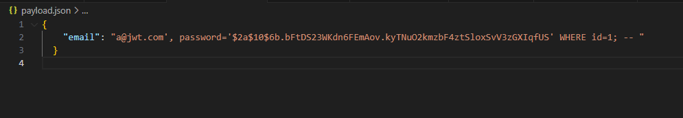
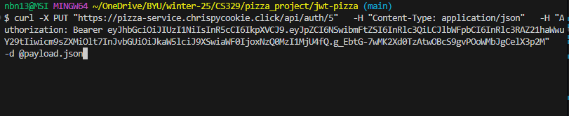
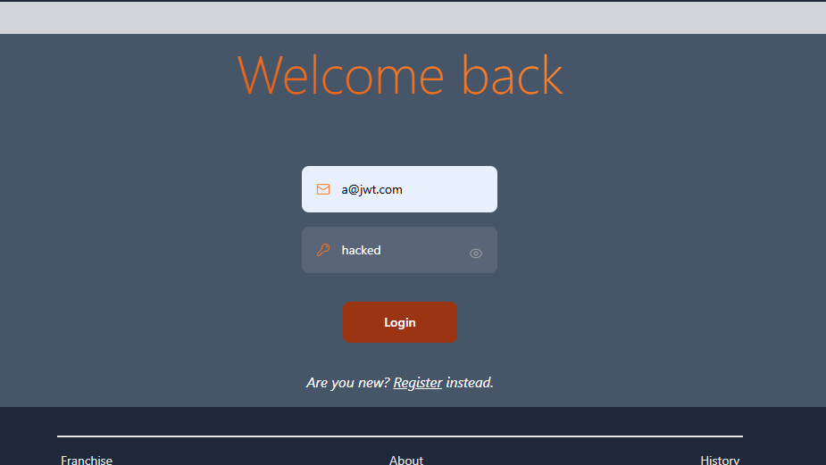
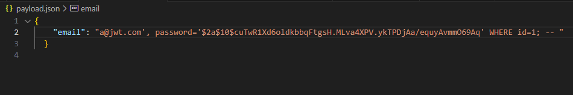
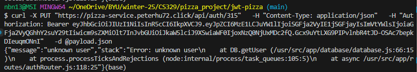
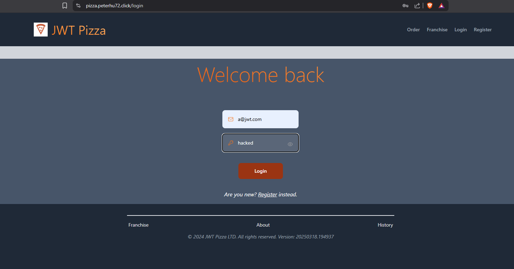

# SQL Injection Attack Record

## Peter Hu and Nathan Neilson Attacks

### Personal Attack: Nathan Neilson
| Item | Result |
|------|--------|
| Date | April 14, 2025, 10:51 AM |
| Target | pizza.chrispycookie.click |
| Classification | SQL Injection |
| Severity | 1 - High |
| Description | Successfully executed SQL injection attack by modifying the admin password to "hacked" through a malicious payload. The attack targeted the authentication endpoint and allowed unauthorized access to admin controls, granting complete control over the application. The injection was performed by sending a crafted JSON payload that included SQL commands to modify the password in the database where id=1. After the attack, was able to log in with email "a@jwt.com" and password "hacked" to gain administrative access. |
| Images |  Malicious payload.json with SQL injection code   Execution of the attack using curl command with JWT token   Successfully logged in with compromised credentials |
| Corrections | - Replace string concatenation in SQL queries with parameterized queries - Specifically in the `updateUser` function, modify the code to use prepared statements with placeholders (?) instead of directly inserting values - Implement proper input validation to reject SQL patterns - Use parameterized queries for all database operations |
| Corrections | |

### Partner Attack: Nathan Neilson attacks Peter Hu
| Item | Result |
|------|--------|
| Date | April 14, 2025, 11:21 AM |
| Target | pizza.peterhu72.click |
| Classification | SQL Injection |
| Severity | 1 - High |
| Description | Successfully executed SQL injection attack by modifying the admin password to "hacked" through a malicious payload. The attack targeted the authentication endpoint and allowed unauthorized access to admin controls, granting complete control over the application. The injection was performed by sending a crafted JSON payload that included SQL commands to modify the password in the database where id=1. After the attack, was able to log in with email "a@jwt.com" and password "hacked" to gain administrative access. |
| Images |  Malicious payload.json with SQL injection code   Execution of the attack using curl command with JWT token   Successfully logged in with compromised credentials |
| Corrections | - Replace string concatenation in SQL queries with parameterized queries - Specifically in the `updateUser` function, modify the code to use prepared statements with placeholders (?) instead of directly inserting values - Implement proper input validation to reject SQL patterns - Use parameterized queries for all database operations |
| Corrections | Fixed by eliminating string concatentation and parameterizing the query. |

### Personal Attack: Peter Hu
| Item | Result |
|------|--------|
| Date | April 14, 2025, 4:50 PM |
| Target | pizza.peterhu72.click |
| Classification | Server Side Request Forgery |
| Severity | 1 - High |
| Description | Could change the pricing of a pizza to 0 by changing the request client side. |
| Image | [Free Pizza](FreePizza2.png) |
| Corrections | Make sure to validate the request in the server after the request is made. [No Free Pizza](no_freepizza.png) |

### Personal Attack: Peter Hu attacks Nathan Neilson
| Item | Result |
|------|--------|
| Date | April 14, 2025, 4:51 PM |
| Target | pizza.chrispycookie.click |
| Classification | Server Side Request Forgery |
| Severity | 1 - High |
| Description | Could change the pricing of a pizza to 0 by changing the request client side. |
| Image | [Free Pizza](freepizza.png) |
| Corrections | Need to make sure to validate the request in the server after the request is made. |

### Summary of Learnings

- SQL Injection is a very serious issue that can be used to gain unauthorized access to the database.
- Server Side Request Forgery is a very serious issue that can be used to gain unauthorized access to the database.
- Always validate the request in the server after the request is made.
- Always use parameterized queries for all database operations.
- Always use JWT tokens for authentication.

